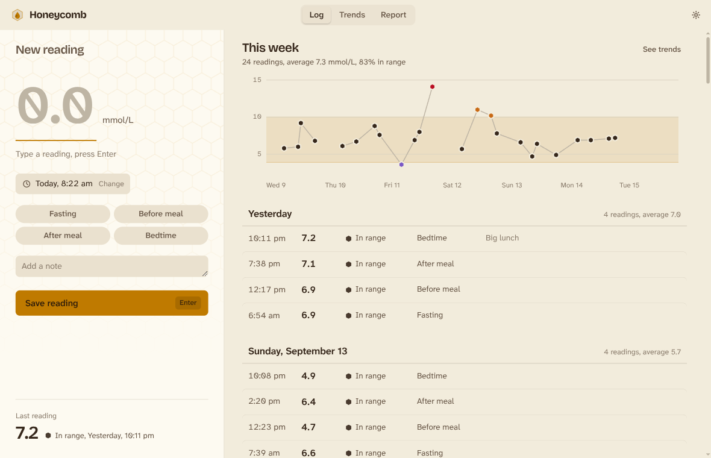
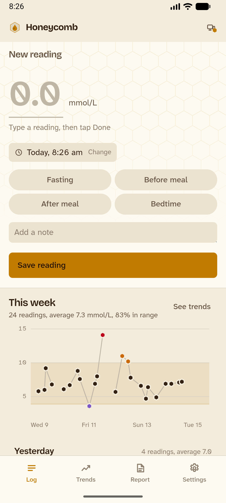
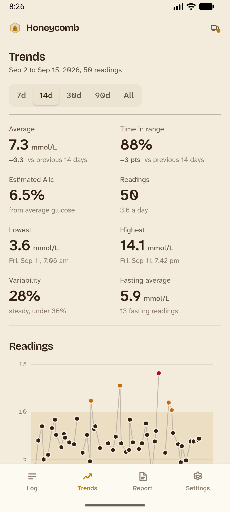
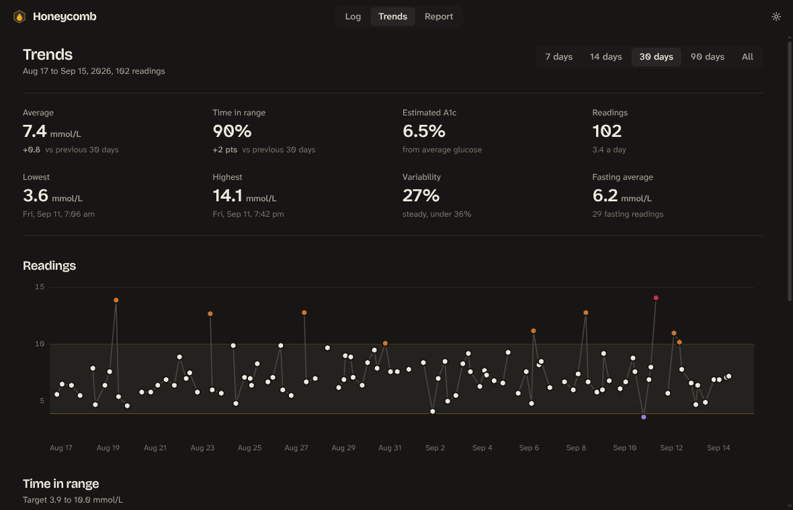

<p align="center">
  
</p>

<h1 align="center">Honeycomb</h1>

<p align="center">
  A calm blood glucose journal for Linux and Android.<br>
  Log a reading in seconds, watch the trends, hand your doctor a clean report,<br>
  and keep every device in step with no account and no server.
</p>

<p align="center">
  <picture>
    <source media="(prefers-color-scheme: dark)" srcset="docs/screenshots/log-dark.png">
    
  </picture>
</p>

## Why

Living with diabetes means writing down numbers several times a day, for years. Most apps
make that feel like an exam: red numbers, alerts, streaks. Honeycomb takes the opposite view.
The reading is big and unjudged, the status is a quiet word beside it, colour only appears when
something is actually off, and nothing nags. Your data sits in a plain file you own, on machines
you own.

## What it does

- **Fast logging.** Open the app and the reading field already has focus. Type a number and press
  Enter. The time is prefilled and keeps ticking until you change it, with quick presets like
  "30 min ago" for the reading you forgot to log. Optional context (fasting, before or after a
  meal, bedtime) and a note.
- **Honest feedback.** As you type, the app tells you whether the reading is in range, high, low,
  or very high, in words, not just colours. Nothing shouts.
- **Trends.** Average, time in range, estimated A1c, lowest and highest, variability, and fasting
  average over 7, 14, 30, or 90 days, each compared with the period before. Step back through
  earlier periods with the arrows, or pick any two dates. A readings chart with the target band,
  time in range by day or week, and a time-of-day view that shows when your levels tend to run high.
- **A report for your doctor.** A printable sheet with the summary figures, chart, and a table of
  every reading. Save it as a PDF, export a CSV, or copy a plain-text summary.
- **Your data stays yours.** Readings are stored as CSV in `~/.local/share/honeycomb/readings.csv`.
  Point the app at a different file if you prefer, or import an export on a new machine.
- **Sync between devices, no account needed.** Pair two computers, or a computer and a phone, and
  they keep the same readings. Devices talk to each other directly with end-to-end encryption.
  A device that was off simply catches up the next time both are running.
- **Android.** The same app, with a phone layout, syncs with your desktop.

<p align="center">
  
  &nbsp;&nbsp;
  
</p>

- **Units and targets.** mmol/L or mg/dL, an adjustable target range, 12 or 24 hour clock, and a
  light or dark theme that follows your system.



## Install

Packages for each release are on the [Releases page](https://github.com/Gingerbreadfork/honeycomb/releases):
an `.rpm` for Fedora and friends, a `.deb` for Ubuntu and Debian, and an `.apk` for arm64 Android
phones, with a `SHA256SUMS` file alongside.

```sh
sudo dnf install ./Honeycomb-<version>.x86_64.rpm     # Fedora
sudo apt install ./Honeycomb_<version>_amd64.deb      # Ubuntu, Debian
adb install Honeycomb-<version>-arm64.apk             # Android, or copy the file to the phone
```

The Android package is signed with the project's own key, so the phone will ask you to allow
installing from this source.

### From source

You need Node 20 or newer, [pnpm](https://pnpm.io), a Rust toolchain, and the WebKitGTK
development packages that [Tauri 2 requires](https://v2.tauri.app/start/prerequisites/#linux).

```sh
git clone https://github.com/Gingerbreadfork/honeycomb
cd honeycomb
./install.sh
```

`install.sh` builds the app and installs it for your user under `~/.local` (binary, icon, and
launcher entry). No root needed. For system packages instead:

```sh
pnpm install
pnpm tauri build          # writes .rpm and .deb to src-tauri/target/release/bundle/
```

## Android

```sh
./android-build.sh        # builds a signed release APK for arm64 phones
```

This needs the Android SDK, an NDK, and a JDK 17 or 21. Set `ANDROID_HOME`, `NDK_HOME`, and
`JAVA_HOME` if they are not found automatically. The script creates a personal signing key at
`~/.config/honeycomb/android-release.jks` on first use; keep it, because updates have to be
signed with the same key. The APK is written to `src-tauri/target/release/bundle/android/`.
Install it with `adb install` or copy it to the phone.

On the phone, readings live in the app's private storage and are left out of Android's cloud
backup and phone-to-phone transfer. Use sync, Copy CSV, or Copy summary to get them out, and pair
a new phone rather than restoring onto it.

## Syncing between devices

Open Settings, then Devices, and choose Pair a device.

- **Same network.** Other computers running Honeycomb show up automatically. Tap Pair, confirm the
  four-digit code shown on both screens, done.
- **Anywhere else.** Show a code on one device and enter it on the other. Codes work once and
  expire after ten minutes.

After pairing, sync is automatic: on startup, after every change, when the window regains focus,
and every couple of minutes. Both devices need to be running for a sync to happen. On a desktop
you can turn on "Keep syncing after the window is closed" so it stays reachable in the background.

How it works: every reading carries an id and a last-edited stamp, and deletions are kept as hidden
tombstones for two years. A sync first compares a fingerprint of both sides; only when they differ
do the devices exchange their rows and keep the newer version of each. Edits and
removals made while apart merge cleanly in both directions. Connections use
[iroh](https://iroh.computer): encrypted QUIC keyed to each device's identity, direct wherever
possible, with public relay servers used only to get through home routers. Relays never see your
data.

## The data file

```csv
time,glucose,unit,context,note,id,updated,deleted
2026-09-15T08:42:00+10:00,6.4,mmol/L,fasting,,k3v9tq2xm8pd,2026-09-15T08:42:07.512+10:00,
```

The first five columns are what you would expect. Each time keeps the UTC offset of the place it
was taken, and the app shows it by that clock: a reading logged at 8 am in Sydney still reads 8 am
when you open the file in London. The last three exist for sync and are harmless
in a spreadsheet. The export from the Report page is the tidy five-column version without deleted
rows. Files without the extra columns, including exports and reasonably named spreadsheets with a
time and a glucose column, import cleanly, and importing the same file twice adds nothing.

Before the first change on any day, the file as it stood is copied to
`~/.local/share/honeycomb/backups/readings-<date>.csv`. The last 14 are kept. To go back to one,
quit the app and copy it over `readings.csv`, or import it to bring back only what is missing.

Settings live in `~/.config/honeycomb/settings.json`. Edits made to the data file outside the app
are picked up the next time the window gains focus.

## Develop

```sh
pnpm install
pnpm tauri dev            # native window with hot reload
pnpm dev                  # browser only, data kept in localStorage
pnpm check                # svelte-check
pnpm test                 # vitest
cargo test --manifest-path src-tauri/Cargo.toml
pnpm tauri android dev    # run on a connected device or emulator
```

### Releasing

Pushing a tag like `v0.2.0` runs the release workflow, which runs the tests, builds the Linux
packages and attaches them to a GitHub release. The tag has to match the version in
`package.json`, `src-tauri/tauri.conf.json` and `src-tauri/Cargo.toml`;
`./scripts/check-version.sh` tells you whether the three agree. The Android job also runs if the repository has two secrets:
`ANDROID_KEYSTORE_BASE64` (the signing keystore, base64 encoded) and `ANDROID_KEYSTORE_PASS`.
Without them, build the APK locally with `./android-build.sh` and upload it by hand.

`HONEYCOMB_PROFILE=name` runs a separate copy with its own data and no single-instance lock, which
is handy for testing sync between two instances on one machine.

Built with [Tauri 2](https://v2.tauri.app), [Svelte 5](https://svelte.dev), and
[iroh](https://iroh.computer). Type is Atkinson Hyperlegible Next for numbers and text, and
Bricolage Grotesque for headings.

## Keyboard

| Keys | Action |
| --- | --- |
| Enter | Save the reading |
| Ctrl+1, Ctrl+2, Ctrl+3 | Log, Trends, Report |
| Ctrl+, | Settings |
| Ctrl+Q | Quit |

## A note on the numbers

Estimated A1c is calculated from the average of your readings using the glucose management
indicator formula. It is an estimate for your own reference, not a laboratory result, and
fingerstick readings taken at chosen moments are not the same as continuous monitoring. Talk to
your care team about your targets and what the numbers mean for you.

## License

MIT. See [LICENSE](LICENSE).
